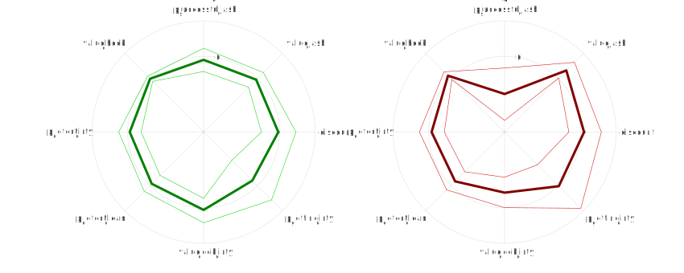
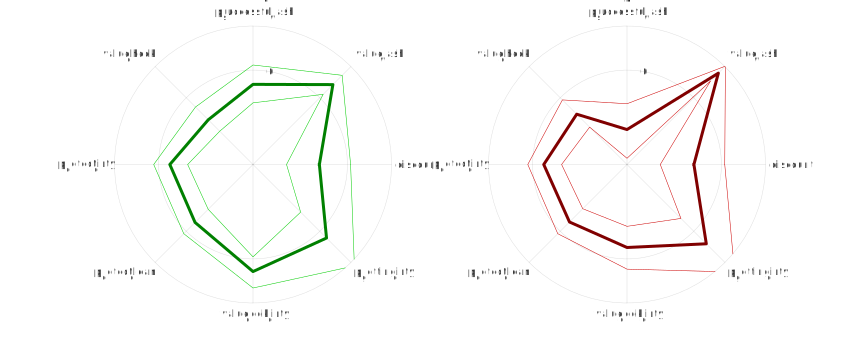
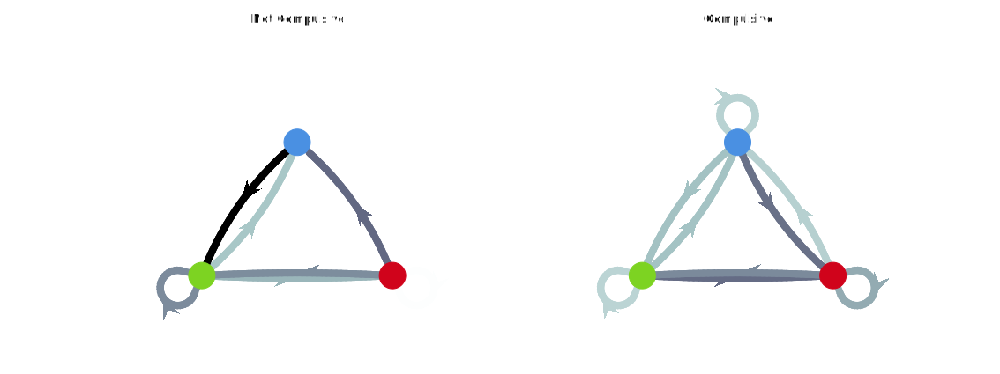
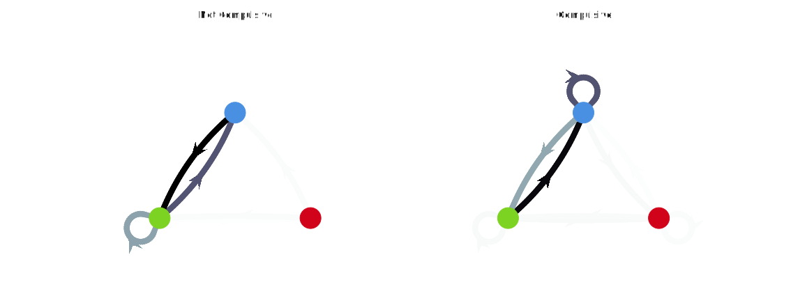
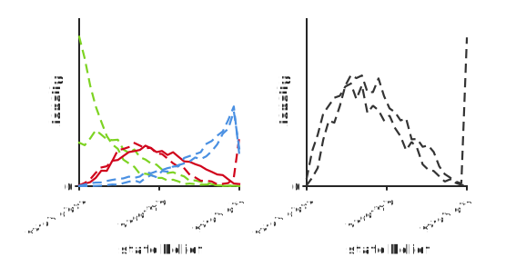
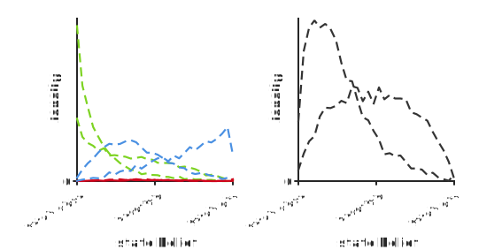
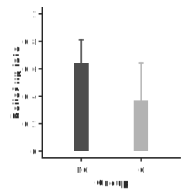
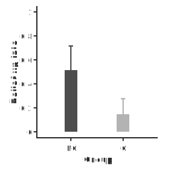

# Simulations

## Random parameter generation

Probabilities of transition were uniformly sampled over their entire support, ie. $[0, 1]$. For observations, as state inference is symmetrical around chance level ($p = 0.5$), probability of the observation being correct was only sampled over $[0.5, 1]$. Concerning the action valuation, defined entirely by the set $\{ value_{wash}, value_{check}, value_{cook|dirty}, value_{cook|clean}\}$, we used the fact that a POMDP policy is invariant to linear transformations of the value function. Using the linear mapping:

$$
z(v) = \frac{v - value_{cook|clean}}{value_{wash} + value_{check} + value_{cook|dirty}}
$$

we have:

$$
\begin{aligned}
z(value_{cook|clean}) & = & 0 \\
z(value_{wash}) & \in & [0, 1]\\
z(value_{check}) & \in & [0, 1]\\
z(value_{cook|dirty}) & \in &[0, 1]\\
z(value_{wash}) + z(value_{check}) + z(value_{cook|dirty}) & = & 1
\end{aligned}
$$

In other words, $[z(value_{wash}), z(value_{check}), z(value_{cook|dirty})]$ is a point on the unit 2-simplex. By sampling uniformly over the 2-simplex, we therefore exhaust all the possible parametrisations of the value function.

In summary, we sampled the parameters of our POMDP problem allowing them to take *any* possible (valid) value, ensuring a complete exploration of the parameter space in our simulations.

## Worlds

We repeatedly sampled random sets of parameters and simulated {{simulations.N_SIMULATIONS}} sequences of {{simulations.T_SIMULATIONS}} actions according to the corresponding optimal policy. We collected parameterisations yielding an optimal policy which a) included all three actions (check, wash, cook) and 2) did not contain any compulsive bouts, until we obtained {{simulations.N_WORLDS}} valid parameter sets (worlds).

## Agents

To simulate our agents, we randomly drew new sets of parameters capturing the agent's subjective representation of the world parameters. For each agent, we then computed the (subjectively) optimal policy, simulated the {{simulations.N_SIMULATIONS}} sequences of {{simulations.T_SIMULATIONS}} actions by letting the agent interact with a given world, and verified if the agent showed any compulsive bouts. We collected for each of the {{simulations.N_WORLDS}} worlds {{simulations.N_AGENTS_PER_GROUP}} compulsive and {{simulations.N_AGENTS_PER_GROUP}} non compulsive agents. We run this procedure twice, with different constraints on the policy:

- **mandatory check**: only agents including all three actions in their optimal policy were included. This collection of agents is refered to as the `full 1A` dataset.

- **relaxed checking constraint**: in this case, we also included agents whose policy did not include the *check* action. This collection of agents is refered to as the `full 1B` dataset.

Note that the two datasets were simulated on the same worlds.

# Full parameter-set distortion

## Representation fingerprint

### Mandatory checking

{{ #csv tables/fingerprint_must_check.csv width=15:12:4:12:5:6:5:2:6 align=lcccccccc }}
: Difference between subjective and objective parameters for each group in the full 1A dataset. {#tbl:fingerprint_must_check}

### Relaxing checking constraint

{{ #csv tables/fingerprint_allow_no_check.csv width=15:12:4:12:5:6:5:2:6 align=lcccccccc }}
: Difference between subjective and objective parameters for each group in the full 1B dataset. {#tbl:fingerprint_allow_no_check}

## Transitions

### Mandatory checking

{{ #csv tables/transition_must_check.csv width=7:7:7:3:4:2:4 align=lcccccc }}
: Empirical probability of transition for each group in the full 1A dataset. {#tbl:transition_must_check}

### Relaxing checking constraint

{{ #csv tables/transition_allow_no_check.csv width=7:7:7:3:4:2:4 align=lcccccc }}
: Empirical probability of transition for each group in the full 1B dataset. {#tbl:transition_allow_no_check}

## Compulsion type

## Belief distribution

### Mandatory checking

{width=70%}

{{ #csv tables/beliefs_density_must_check.csv width=5:9:9:3:4:2:4 align=lcccccc }}
: Subjective belief about the state of the world (clean/dirty) when deciding to perform each action. {#tbl:belief_must_check}

### Relaxing checking constraint

{width=70%}

{{ #csv tables/beliefs_density_allow_no_check.csv width=5:9:9:3:4:2:4 align=lcccccc }}
: Subjective belief about the state of the world (clean/dirty) when deciding to perform each action. {#tbl:belief_allow_no_check}

## Belief update

### Mandatory checking

{width=40%}

{{ #csv tables/beliefs_update_must_check.csv width=7:7:7:3:4:2:4 align=lcccccc }}
: Amplitude of change in subjective belief about the state of the world (clean/dirty) after performing a 'wash' action. {#tbl:belief_update_must_check}

### Relaxing checking constraint

{width=40%}

{{ #csv tables/beliefs_update_allow_no_check.csv width=7:7:7:3:4:2:4 align=lcccccc }}
: Amplitude of change in subjective belief about the state of the world (clean/dirty) after performing a 'wash' action. {#tbl:belief_update_allow_no_check}

## Compulsion severity as a function of parameter misalignment

All the results below are derived for the fully random parameters dataset, i.e. all agents have all their subjective parameters distorted.

<!-- #include texts/regression_full.md -->

# Single parameter perturbation

In all the results below, only the parameter of interest is randomly distorted while all other parameters are kept aligned to the objective world parameters. Therefore, a new dataset has been simulated for each analysis.

## Compulsion severity as a function of parameter misalignment

<!-- #include texts/regression_single.md -->
